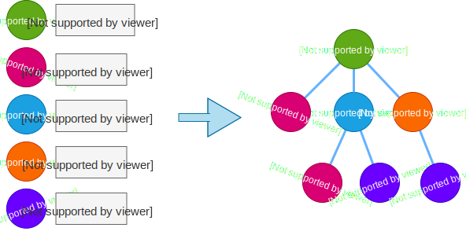

## Важно ☝️ <!-- .element: class="green" -->

1. удобно и безошибочно формировать GraphQL-запросы <!-- .element: class="gray" -->
2. хитро слать запросы на сервер <!-- .element: class="gray" -->
3. эффективно кешировать ответы и работать с данными <!-- .element: class="green" -->

-----

## 3. Эффективно кешировать GraphQL-ответы и работать с данными <!-- .element: class="green" -->

Это когда на клиенте нормализованный стор с подписками

-----

## Хотите расскажу <br/>страшный "косяк" <br/>GraphQL? <!-- .element: class="red" -->

-----

## В плюсах у GraphQL есть такое: <br/><span class="green">что запросили, то и получили.</span>

### <br/><span class="fragment red">Но это может стать и минусом</span>

-----

### На запрос:

#### дай 100 статей и к каждой верни данные по автору

```graphql
query {
  articles(limit: 100) {
    title
    author {
      name
      surname
      ...other_100500_fields
    }
  }
}

```

### Мы можем получить много раз одни и те же данные автора к разным статьям. <!-- .element: class="fragment red" -->

-----

### Проблема в том, что на "слабом" клиенте <br/><span class="red">плохо хранить кучу денормализованных (дублирующихся) данных</span>

-----

### Проблема в том, что если данные автора изменились, <br/><span class="red">то накладно пробегаться по всем местам и везде их обновлять</span>

-----

### В этом плане очень сильно <br/><span class="green">помогает нормализованный стор</span>, <br/>который есть у Relay и ApolloClient.

-----

## Нормализованный кэш/стор

 <!-- .element: style="width: 800px;" class="plain"  -->

Древовидный GraphQL-ответ приводится к плоскому списку

-----

#### С другим запросом пришли обновлённые данные – обновились записи в нормализованном сторе

 <!-- .element: style="width: 800px;" class="plain"  -->

-----

### С нормализованным стором

- вам не важно сколько раз вам вернулись данные
- насколько глубоко они вложены в графкуэль-ответе

<span class="green fragment">Записи хранятся компактно, происходит дедупликация.</span>

-----

## Watchers (подписки на сторе)

-----

### Отправили первый запрос, сформировалась подписка

 <!-- .element: class="plain"  -->

-----

### В другом запросе прилетели обновленные данные

 <!-- .element: class="plain"  -->

-----

### Подписка на первый запрос передёргивается, и возвращается ответ с обновленными данными

 <!-- .element: style="width: 800px;" class="plain"  -->

-----

### ApolloClient или Relay с фрагментами, «волосатый» GraphQL

<a href="https://youtu.be/VdoPraj0QqU" target="_blank"></a>

<https://youtu.be/VdoPraj0QqU>

HolyJS Piter 2019
