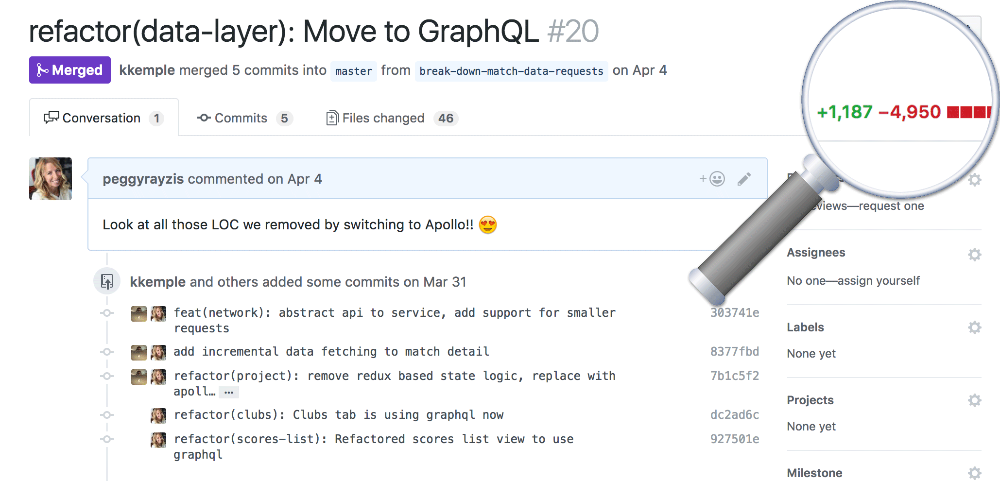

# ApolloClient

-----

## Что такое ApolloClient?

- Это GraphQL-клиент (фреймворк агностик) <!-- .element: class="fragment green" -->
  - Отвечает за сетевое взаимодействие с GraphQL-сервером <!-- .element: class="fragment" -->
  - Сам формирует Стор и кэширует в нем ответы от сервера <!-- .element: class="fragment" -->
  - Дает возможность взаимодействовать со стором <!-- .element: class="fragment" -->
- Это куча провайдеров (для React, Angular, Vue, Swift, Java) <!-- .element: class="fragment orange" -->
  - Отдает фреймворк специфик примитивы <!-- .element: class="fragment" -->
    - Контекст провайдер, хуки, хоки, рут-компоненты <!-- .element: class="fragment" -->
    - Rerender компонент при изменениях в сторе <!-- .element: class="fragment" -->
- Это утилита для генерации типов (TS, flow, swift, scala) <!-- .element: class="fragment red" -->

-----

## Где Аполло клиент круче Редакса?

В декларативном КЭШИРОВАНИИ и взаимодействии с серверным СТЕЙТОМ <!-- .element: class="green" -->

-----

### ApolloClient стандартизирует и упрощает работу с серверыми данными. <!-- .element: class="green" -->

###  Redux можно продолжать использовать для клиентского состояния (формы, игры и пр...) <!-- .element: class="fragment orange" -->

###  Но нужен ли ещё Redux?.. Решать вам! <!-- .element: class="fragment red" -->

-----

## У себя я Redux выпилил  ещё 3 года тому назад <!-- .element: class="red" -->

- Серверный кэш – в ApolloClient'е <!-- .element: class="fragment" -->
- Роутинг – в браузерной строке <!-- .element: class="fragment" -->
- Формочки – в React-стейте или в final-forms <!-- .element: class="fragment" -->
- Авторизация, региональные настройки – в свои классах EventEmitter'ах <!-- .element: class="fragment" -->
- А больше у меня нет мест, куда бы Redux сгодился <!-- .element: class="fragment orange" -->

-----

## ApolloClient vs Redux

 <!-- .element: style="max-width: 800px" -->

<small>
  <a href="https://blog.apollographql.com/reducing-our-redux-code-with-react-apollo-5091b9de9c2a">https://blog.apollographql.com/reducing-our-redux-code-with-react-apollo-5091b9de9c2a</a> by Peggy Rayzis
  <a href="https://habr.com/ru/post/331088">https://habr.com/ru/post/331088</a> перевод от KarafiziArthur
</small>

-----

## What we deleted <!-- .element: class="red" -->

- Matches reducer (~300 lines of code)
- Data fetching action creators (~800 LOC)
- Batching logic & socket updates (~750 LOC)
- Local storage action creators (~1000 LOC)
- Redux logic separated from UI components (~1000 LOC)
- Tests with all of the above (~1000 LOC)

-----

## В сухом остатке – ApolloClient про <!-- .element: class="green" -->

- сеть и связь с сервером <!-- .element: class="fragment" -->
- кэш/стор серверных данных <!-- .element: class="fragment" -->
- фреймворк коннекторы (React и пр.) <!-- .element: class="fragment" -->
- статический анализ (graphql-code-generator) <!-- .element: class="fragment" -->

-----

## Что важно запомнить:

### Аполло только для кеша серверных данных,  а Редакс для клиентского стейта. <!-- .element: class="fragment green" -->

-----

## Ещё можно сравнить так: <!-- .element: class="gray" -->

### Redux – ближе к паттерну проектирования

### ApolloClient – ближе к фреймворку
