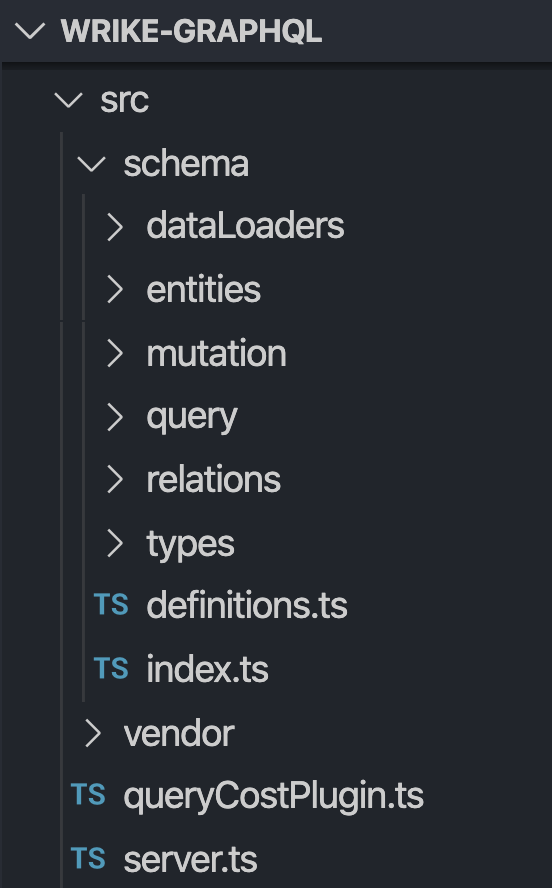

# Методология построения GraphQL-прокси к REST API

-----

## Практическая методология –  это алгоритм, набор приёмов и способов того, как достичь желаемой практической цели.

-----

- M1: Создание обёртки к REST API `vendor`
- M2: Описание общих GraphQL-типов `schema/types`
- M3: Описание Entity `schema/entities`
- M4: Описание точек входа в граф `schema/query`
- M5: Расширение Entity прямыми связями по id
- M6: Создание DataLoaders (N+1) `schema/dataLoaders`
- M7: Создание резолверов Реляций `schema/relations`
- M8: Прикручивание QueryCost (DDOS)
- M9: Авторизация

-----

 <!-- .element: style="max-width: 400px;" class="plain" -->

-----

#### Repo: <https://github.com/nodkz/wrike-graphql>

#### Live demo: <https://graphql-wrike.herokuapp.com>

#### Voyager: <https://graphql-wrike.herokuapp.com/voyager>

#### Docker: <https://hub.docker.com/r/nodkz/wrike-graphql>
