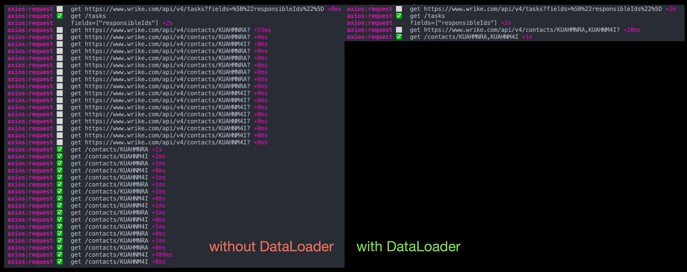

## M6: Создание DataLoaders

## для решения проблемы N+1

-----

### Что такое DataLoader?

-----

### Проблема N+1 хорошо расписана у меня в REPO: <https://github.com/nodkz/conf-talks/blob/master/articles/graphql/dataloader/N+1.md>

-----

### В нашем примере ДатаЛоадеры позволяют решить проблему N+1 и сократить кол-во HTTP запросов к REST API.

 <!-- .element: style="max-width: 1100px;" class="plain" -->

-----

### DataLoader – это batch loader: <!-- .element: class="orange" -->

- у него из разных мест запрашивают Entity по любому id <!-- .element: class="fragment" -->
- он возвращает Promise на каждый запрос <!-- .element: class="fragment" -->
- на nextTick группирует все id и делает 1 запрос findMany(ids) <!-- .element: class="fragment" -->
- получает ответ и разрезолвивает промисы в шаге 2 <!-- .element: class="fragment" -->

-----

```ts
import DataLoader from 'dataloader';
import { taskFindByIds } from 'app/vendor/task/taskFindByIds';

const dl = new DataLoader(async (ids) => {
  const results = await taskFindByIds({ ids });
  return ids.map(
    (id) => results.find((x) => x.id === id) || new Error(`Task: no result for ${id}`)
  );
});

const dataPromise1 = dl.load(1);
const dataPromise2 = dl.load(2);
const arrayDataPromise = dl.loadMany([2, 10, 15]);

```

-----

### Существует 3 scope, где можно создать DataLoader'ы <!-- .element: class="orange" -->

- Глобальный на сервер <span class="gray">(1 раз при старте сервера)</span>
- Глобальный на операцию <span class="gray">(в рамках 1 http-запроса)</span>
- Локальный на поле в запросе <span class="gray">(для конкретного 1го поля в 1ом запросе)</span>

-----

### Дата-лоадеры в демо wrike-graphql <!-- .element: class="orange" -->

- **0 глобальных на сервер** <span class="gray">(обычно жёсткие справочники)</span>
- **8 глобальных на операцию** <span class="gray">(записи возвращаются полностью, смело можно использовать глобально в рамках запроса)</span>
- **4 fieldNode-specific** <span class="gray">(зависят от запрошенных полей в запросе)</span>

12 DataLoaders serves 51 direct relations ☝️ <!-- .element: class="fragment green" -->

-----

### Встраивать DataLoader'ы в resolve-методы достаточно муторно, много копипасты:

```ts
const ArticleType = new GraphQLObjectType({
  name: 'Article',
  fields: () => ({
    author: {
      type: AuthorType,
      resolve: (source, args, context, info) => {
        // context.dataloaders был создан на уровне сервера (см сниппет кода выше)
        const { dataloaders } = context;

        // единожды инициализируем DataLoader для получения авторов по ids
        let dl = dataloaders.get(info.fieldNodes);
        if (!dl) {
          dl = new DataLoader(async (ids: any) => {
            // обращаемся в базу чтоб получить авторов по ids
            const rows = await authorModel.findByIds(ids);
            // IMPORTANT: сортируем данные из базы в том порядке, как нам передали ids
            const sortedInIdsOrder = ids.map(id => rows.find(x => x.id === id));
            return sortedInIdsOrder;
          });
          // ложим инстанс дата-лоадера в WeakMap для повторного использования
          dataloaders.set(info.fieldNodes, dl);
        }

        // юзаем метод `load` из нашего дата-лоадера
        return dl.load(source.authorId);
      },
    },
  }),
});

```

-----

### поэтому генерируем через `resolveOneViaDL`:

```diff
TaskTC.addFields({
  author: {
    type: () => ContactTC,
-    // Старый метод с N+1 проблемой
-    resolve: async (source, args, context, info) => {
-      return contactFindById(source?.authorId, context);
-    },
+    // Новый метод через DataLoader
+    resolve: resolveOneViaDL('ContactID', (s) => s.authorId),
  },
});

```

-----

### `resolveOneViaDL()` возвращает resolve метод для GraphQL

``` js
export function resolveOneViaDL(
  entityName: DataLoaderEntityNames,
  idGetter: (s, a, c, i) => string
): GraphQLFieldResolver<any, any> {
  return (source, args, context, info) => {
    const id = idGetter(source, args, context, info);
    if (!id) return null;
    return getDataLoader(entityName, context, info).load(id);
  };
}

```

<span class="fragment" data-code-focus="5-9" />
<span class="fragment" data-code-focus="3,6" />
<span class="fragment" data-code-focus="2,8">и используем ещё один генератор `getDataLoader()`</span>

-----

### `getDataLoader()`

```js
/**
 * Get DataLoader instance, global o fieldNode specific
 */
function getDataLoader(
  entityName: keyof typeof DataLoadersCfg,
  context: Record<string, any>,
  info: GraphQLResolveInfo
) {
  if (!context.dataLoaders) context.dataLoaders = new WeakMap();
  const { dataLoaders } = context;

  // determine proper key in Context for DataLoader
  const cfg = DataLoadersCfg[entityName];
  let contextKey: any;
  if (cfg.kind === DataLoaderKind.FieldNode) {
    // available for only current fieldNode
    contextKey = info.fieldNodes;
  } else {
    // available for all field levels
    contextKey = cfg;
  }

  // get or create DataLoader in GraphQL context
  let dl: DataLoader<any, any> = dataLoaders.get(contextKey);
  if (!dl) {
    dl = cfg.init(context, info);
    dataLoaders.set(contextKey, dl);
  }
  return dl;
}

/**
 * Mapper config EntityID name to Dataloader creator
 */
const DataLoadersCfg = {
  // Global DataLoaders
  ApprovalID: { init: approvalDLG, kind: DataLoaderKind.OperationGlobal } as DLCfg,
  AttachmentID: { init: attachmentDLG, kind: DataLoaderKind.OperationGlobal } as DLCfg,
  CommentID: { init: commentDLG, kind: DataLoaderKind.OperationGlobal } as DLCfg,
  DependencyID: { init: dependencyDLG, kind: DataLoaderKind.OperationGlobal } as DLCfg,
  CustomFieldID: { init: customFieldDLG, kind: DataLoaderKind.OperationGlobal } as DLCfg,
  TimelogID: { init: timelogDLG, kind: DataLoaderKind.OperationGlobal } as DLCfg,
  TimelogCategoryID: { init: timelogCategoryDLG, kind: DataLoaderKind.OperationGlobal } as DLCfg,
  WorkScheduleID: { init: workScheduleDLG, kind: DataLoaderKind.OperationGlobal } as DLCfg,
  // FieldNodes specific loaders
  AccountID: { init: accountDL, kind: DataLoaderKind.FieldNode } as DLCfg,
  ContactID: { init: contactDL, kind: DataLoaderKind.FieldNode } as DLCfg,
  FolderID: { init: folderDL, kind: DataLoaderKind.FieldNode } as DLCfg,
  TaskID: { init: taskDL, kind: DataLoaderKind.FieldNode } as DLCfg,
};

/**
 * Example of one dataloader creator
 */
export function contactDL(context: any, info: GraphQLResolveInfo) {
  return new DataLoader<string, any>(async (ids) => {
    const results = await contactFindByIds({ ids, info }, context);
    return ids.map(
      (id) => results.find((x) => x.id === id) ||
      new Error(`Contact: no result for ${id}`)
    );
  });
}

```

-----

### Смотрим `schema/dataLoaders`

-----

### Грубая оценка M6

- 13 файлов
- 291 LoC
- Рефакторинг M5 на M6
- ~ `⏱ 20 часов`
